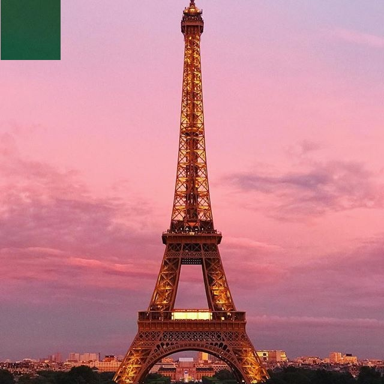

:toc: left
:stylesheet: ubuntu.css
:linkattrs:
:source-highlighter: pygments

== Negative Region With OpenCV

In the old times, when the cameras used an analogic technology, it was common to see some films wich contained negatives images of a picture. In this images, the dark points turn bright, and the bright points turn dark, as you can see in the <<negative_figure>> figure. This effect occour due chemical processes in the film. But today, with digital cameras, this effect isn't commonly seen. However, there are some cases where is intended to have a negative image, like in medicine applications.

--
.Eiffel Tower
image::./images/eiffel.jpg[320,320,align="center",text-align="center"]
.Eiffel Tower Negative
[[negative_figure,Eiffel Tower Negative]]

--

This project will show a simple program that takes an image file and convert it in a negative image. Moreover, there will be the possibility of choose the region that the program will apply the modification. For this, the user must give the image file name and two points. These points will define a rectangular region, and this region will be processed to have the negative effect.

For any suggestion or correction, please contact me: felipeomar.c@gmail.com

