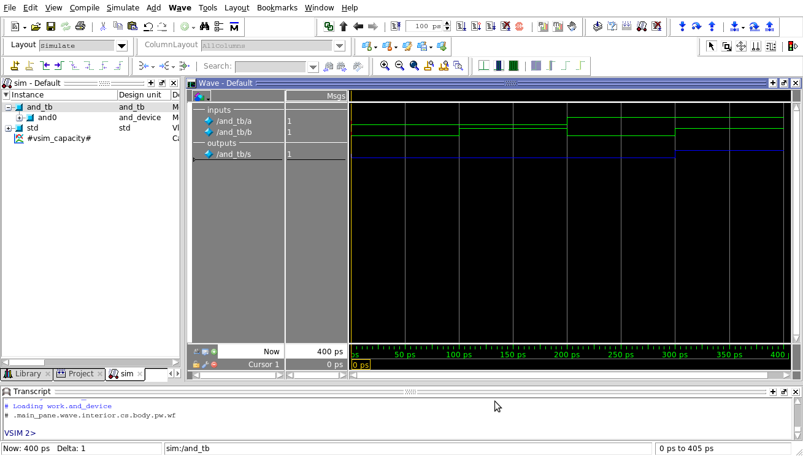

:toc: left
:stylesheet: ubuntu.css
:linkattrs:
:source-highlighter: pygments
[.text-justify]

= A simple component with SystemVerilog

[.text-justify]
This tutorial will show how to describe a component which has the behavior of an AND port. The objective is show some initial points about the SystemVerilog language and the modelsim enviroment. For this, an _and_device_ and an _and_testbench_ will be developed, and tested in a modelsim environment.

== The And Port Design
[.text-justify]
A way to describe a and port in SystemVerilog is given by the next code:

.and_device.sv
[source,systemverilog,options="nowrap"]
----
include::codes/and_device.sv[]
----

Any device can be implemented with the information about its inputs/outputs and behavior. The nexts paragraphs will show how to do this in SystemVerilog, while the code above is explained.

=== Defining Inputs/Outputs

[.text-justify]
Hardware languages has the objective to describe a digital component, telling us everything about your behavior, interconnections and relationship with another components. So, we can define a component by its inputs/outputs and the relantioship between them. To declare a digital component, we can start with a *module* directive:

[source,systemverilog,options="nowrap"]
----
module module_name(); //inputs and outputs goes here
	//Description goes here
endmodule
----

[.text-justify]
After to declarate the module, we have to define which ports are inputs, or outputs. For this, we use the [.underline]_input_ and [.underline]_output_ statement. In the case of a component that have two inputs (_a_ and _b_) and one output (_s_), we can define like this:

[source,systemverilog,options="nowrap"]
----
module and_device(a, b, s);
	input  a;
	input  b;
	output s;

	//Description goes here
endmodule
----

=== Defining the device's behavior
[.text-justify]
After to define the inputs/outputs, we have to describe the relantionship between them. In this moment, there are many ways to do this, from a structural descriptions (with logic elements) until behavorial descriptions. One way to do this with the _And_device_ is:

[source,systemverilog,options="nowrap"]
----
module and_device(a, b, s);
	input  a;
	input  b;
	output s;

	assign s = a & b;
endmodule
----

[.text-justify]
The [.underline]_assign_ statement is known like _continuous assigment_, because any change in the right-hand side, implies in the modification of left-hand side, at same time. So, it is used when we are developing a combinational logic. The _And_ behavior is given by "&" operator. The bit-wise operators in SystemVerilog are the same of C language. We can see more options in the table:

.Bit-Wise Operators
[.center, cols="^1,^1",width=50%, .text-center]
|===
|Operator | Description

|		~			|	Negation
|		&			| And
|		\|		| Inclusive Or
|		^			| Exclusive Or
|		~^		|	Exclusive Nor
|===

[.text-justify]
So, with this assigment, we are describing the relationship between the output and inputs.

== A Simple Testbench Model

=== Component Instantiation
[.text-justify]
After design the device model, we need to simulate its behavior. To do this, we can describe a top-level design, which will contain a device that we need to test. With this top-level design, we can describe a sequence of signals to be applied in the device.

[.text-justify]
First, we instantiate the _and_device_ in our testbench model:

[source,systemverilog,options="nowrap"]
----
module and_testbench();
	logic a, b, s;

	and_device and_device0(a, b, s);

endmodule
----

Another way to do this, is given by:

[source,systemverilog,options="nowrap"]
----
module and_testbench();
	logic a, b, s;

	and_device and_device0(.a(a), .b(b), .s(s));

endmodule
----

[.text-justify]
In the first case, the signals _a_, _b_ and _s_ must be in the same order of the _and_device_ description. In the second case, the signals are explicitly described by [.underline]_.port_name(signal_name)_.

[.text-justify]
The signals created in this testbench are *_logic_* type. The _logic_ is a 4-state type, what means that there are four possible values to be assigned: '0', '1', 'Z'(high impedance) and 'X'(unknown). SystemVerilog also have 2-state types, like: _bit_, _byte_ and _int_. The _Logic_ type, in SystemVerilog, is equivalent to _reg_ type in Verilog.

=== Inputs Behavior
[.text-justify]
Now, the inputs must be changed to verify the _and_device_'s behavior. This can be implemented in this way:

.and_tb.sv
[source,systemverilog,options="nowrap"]
----
include::codes/and_tb.sv[]
----

[.text-justify]
The initial block execute the commands only once, and starts at time 0. The # token means a time delay. So, with this description, we can observe the responses of _and_device_ executing the simulation on  modelsim.

== Modelsim Simulation

[.text-justify]
A modelsim simulation can be implemented by a file with the extention *.do*. In this file, we have to put the modelsim commands for compile and simulate our design. For this project, a file named _and_project.do_ was written, and can be seen bellow:

.and_project.do
[source,tcl,options="nowrap"]
----
include::codes/and_project.do[]
----

[.text-justify]
Finally, to run the simulation, save these three files (and_port.sv, and_tb.sv, and_project.do) in the same directory and execute the next command in your terminal:

[source]
----
vsim -do and_project.do
----

Then, the result is showed:
--
.Testbench Simulation

--
