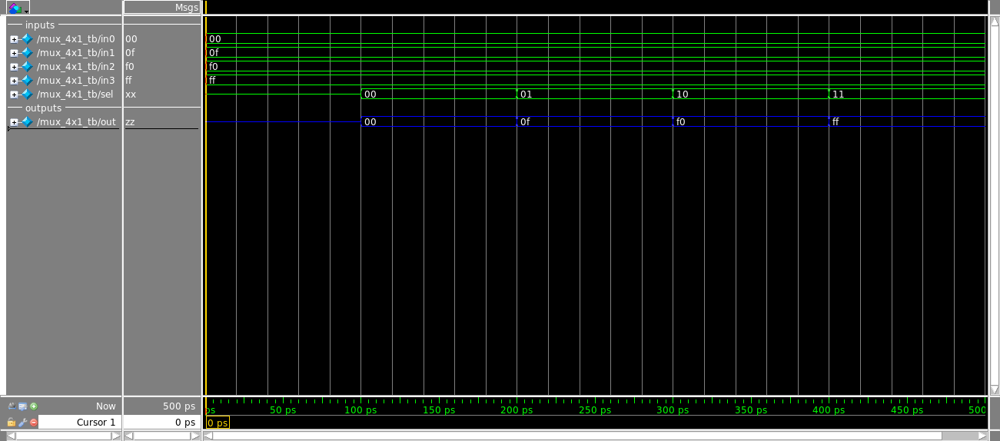

:toc: left
:stylesheet: ubuntu.css
:linkattrs:
:source-highlighter: pygments
[.text-justify]

= Designing a Multiplexer

This tutorial will show how to describe a 8-bit multiplexer 4x1. With this component, we can see the advantages provided by hardware description languages, using a behavioral description. Some new features provided by SystemVerilog will be discussed (like always_comb) and a testbench will be developed too.

== The Mux 4x1 Design
[.text-justify]
A top level view of a multiplexer can be seen in the figure:

--
.mux_4x1
image::./images/componentes.png[200,200,align="center",text-align="center"]
--

And the proposed description is given below:

.mux_4x1_device.sv
[mux_4x1_device.sv]
[source,systemverilog,options="nowrap"]
----
include::codes/mux_4x1_device.sv[]
----

=== Defining Inputs/Outputs
[.text-justify]
Our multiplexer has five inputs: four 8-bit inputs for data, and one 2-bit input for selection. When we have inputs with more than a bit, we use an vector to represent it. In the same way, the output has 8-bit too, so we define the output logic vector. The reason to use the type _logic_ in the output is bacause we will define a behavioral descripition. When we use this kind of description, the compiler requires the logic type. So, we have:

[source,systemverilog,options="nowrap"]
----
module mux_4x1_device(in0,in1,in2,in3,sel,out);
	input  [7:0] in0,in1,in2,in3;
	input  [1:0] sel;
	output logic [7:0] out;

	//Description goes here
endmodule
----

=== Defining the device's behavior
[.text-justify]
Now, we will describe the mux's behavior by a easy way: with case statement (instead the low level description). The compiler will be responsible to make a digital circuit from our description. To make it possible, we have to put the behavior inside a process block, where will be "executed" always that a input change. In verilog, this block is called _always_. But, in SystemVerilog, there is three "kinds" of always: _always_comb_, _always_latch_ and _always_ff_. The _always_comb_ is used for combinational circuits, the _always_latch_ for latched circuits and the _always_ff_  for sequential circuits. These statements were added in SystemVerilog to make the designer's idea more clear, and turn the compiler work more efficient.

[.text-justify]
So, our mux is a combinational circuit, and we want to make a behavioral description. For this, we use the _always_comb_ statement. The final description is given by link:[mux_4x1_device.sv]

[.text-justify]
Note the radix representation of an input, for example *2'b01*. It means a vector with two bits, wich in binary representation is given by "01". Another example is: *8'hFF*. In this case, we are talking about a vector with eight bits, wich in hexadecimal represetation is "FF".

[.text-justify]
With this in mind, our description tell to the compiler: when the _sel_ input is "00", make the output equal to in0. When "01", make the output equal to in1, and so on.

== A Testbench Model

=== Component Instantiation
[.text-justify]
For a testbench, first we need to instatiate the component:

[source,systemverilog,options="nowrap"]
----
module mux_4x1_tb ();
	logic [7:0]	in0,in1,in2,in3;
	logic	[1:0] sel;
	logic [7:0] out;

	mux_4x1_device mux0(in0,in1,in2,in3,sel,out);

endmodule
----

=== Inputs Behavior
[.text-justify]
To test the mux's response, we change the inputs, like this:

.and_tb.sv
[source,systemverilog,options="nowrap"]
----
include::codes/mux_4x1_tb.sv[]
----

[.text-justify]
Remember, the # means a time delay. So, in the begin, we are given a time delay without specify the _sel_ input. After, we test the four possible values of _sel_. The inputs were defined with differents values to make sure wich is transfered to output in the simulation.

== Modelsim Simulation

[.text-justify]
To execute the testbench in modelsim, we need to have the files "mux_4x1_device.sv", "mux_4x1_tb.sv" and "mux_4x1_project.do" in the same folde. The .do file is given below:

.mux_4x1_project.do
[source,tcl,options="nowrap"]
----
include::codes/mux_4x1_project.do[]
----

So, in the terminal we execute this command:

[source]
----
vsim -do mux_4x1_project.do
----

The result can be seen in the next image:

--
.Testbench Simulation

--
